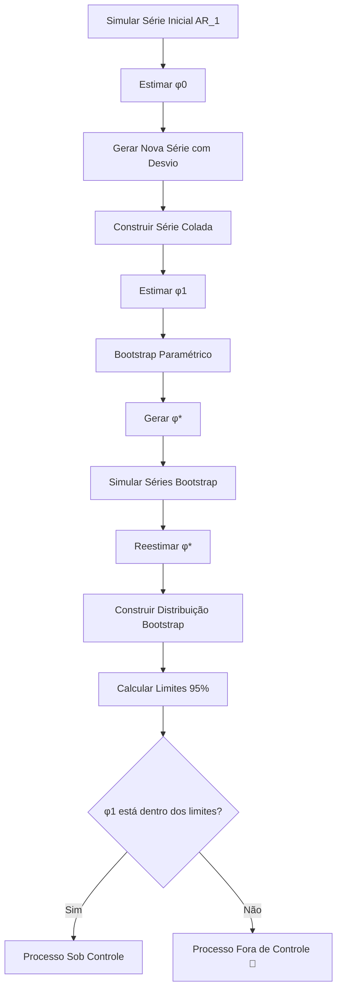

# Cartas de Controle Para Dados Correlacionados

[Visualização](https://ar-kan.github.io/cartas-de-controle-para-dados-autocorrelacionados/)

A metodologia baseia-se na simulação de séries temporais sob um
cenário inicial de controle (H₀), seguido da introdução de possíveis
desvios no parâmetro do modelo (H₁). A partir disso, são construídas
séries denominadas “coladas”, que combinam observações da série original
com observações de uma nova série gerada sob diferentes valores de Φ.
Essa construção permite avaliar o impacto de mudanças no parâmetro ao
longo do tempo, mantendo o tamanho da amostra constante.

Para cada série gerada, ajusta-se um modelo AR(1) via máxima
verossimilhança, obtendo-se estimativas do parâmetro autoregressivo.
A variabilidade dessas estimativas é explorada por meio de um procedimento
de bootstrap paramétrico, no qual novos valores de Φ são amostrados a
partir de uma distribuição normal centrada na estimativa inicial,
respeitando a condição de estacionaridade do processo.

A partir das distribuições bootstrap das estimativas, são obtidos limites
empíricos de controle com base em quantis (95% de confiança). Esses limites
são então utilizados para avaliar se a estimativa do parâmetro na série
colada indica uma possível mudança no processo.

