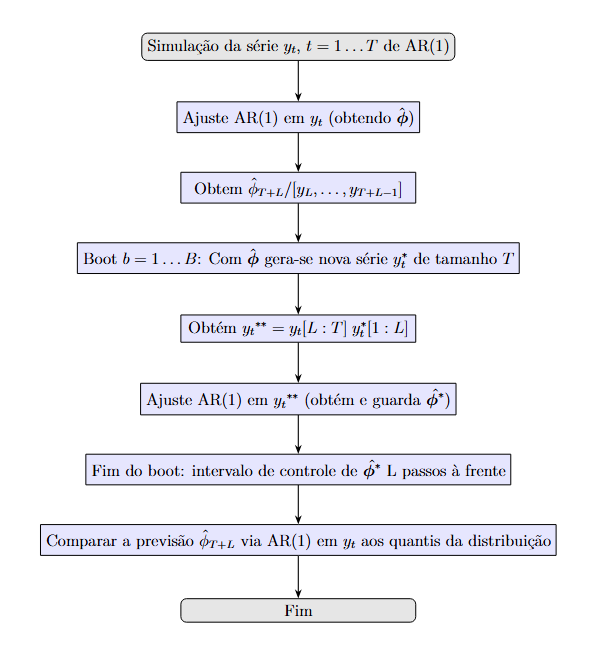
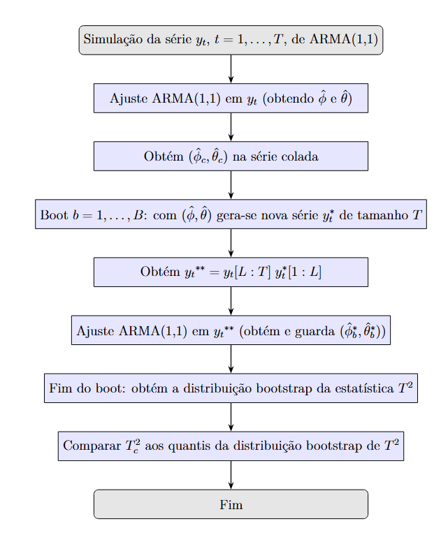
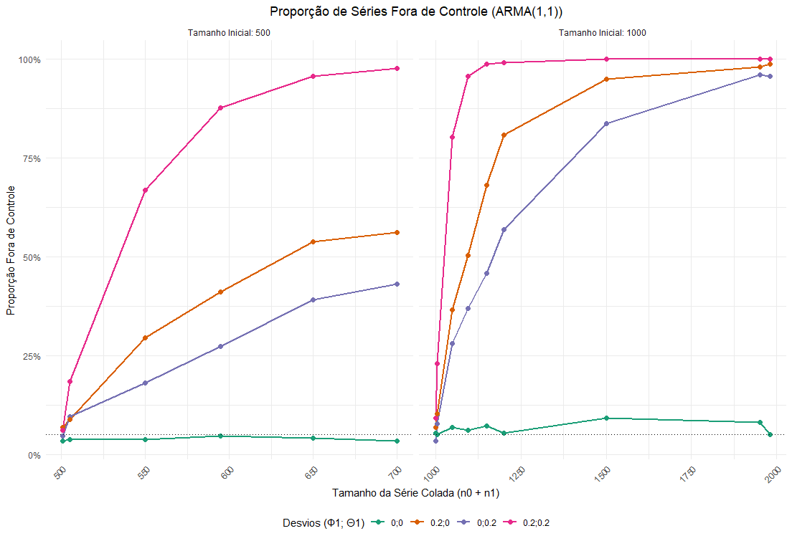

# Cartas de Controle Para Dados Correlacionados

[Visualização](https://ar-kan.github.io/cartas-de-controle-para-dados-autocorrelacionados/)

Para cada série, ajusta-se um modelo ARMA(1,1) por máxima verossimilhança,
obtendo-se estimativas conjuntas dos parâmetros. A variabilidade dessas
estimativas é avaliada via bootstrap paramétrico multivariado, no qual
novos vetores de parâmetros são gerados a partir de uma distribuição normal
multivariada com média e covariância estimadas da série inicial.

Com as amostras bootstrap, constrói-se a distribuição empírica da
estatística T² de Hotelling, definida como uma distância quadrática em
relação à média bootstrap, ponderada pela matriz de covariância inversa.
Os limites de controle são obtidos por quantis dessa distribuição.

A decisão é feita comparando o valor de T² da série colada com esses
limites.

## Controle de AR(1)

## Controle de ARMA(1,1)

## Última execução

